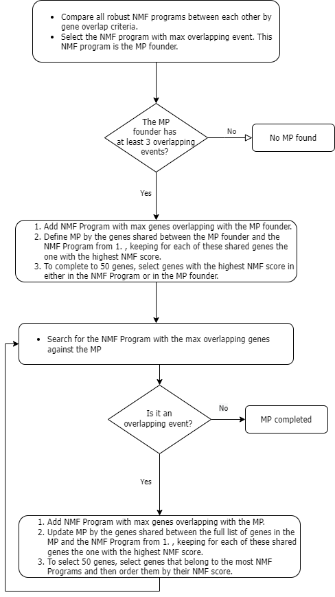

# ITH Programs
### Program Description
This program implements the method described by Gavish et al.[1] to find the Intra-tumoral Heterogeneity (ITH) expression programs. The initial objects were a log normalized cell expression matrices with rows as genes and cells as columns.

1. For each one of our patient's cell expression matrices, we ran 7 different NMF
by using a k ranging from 5 to 11.
2. Based on the NMF score, each NMF Program was then summarized by its top
50 genes.
3. After multiple filters, the remaining NMF Programs were refered to as robust NMF Programs and then clustered in Meta-Programs (MPs).
4. Each MP was Each MP is defined by the 50 most recurrent genes among its NMF Programs

### Clustering method
The clustering method is described in the figure: 
* We considered there was an overlapping event between two NMF Programs if they had a Jaccard index greater than 0.4.

 

[1]. A. Gavish et al., “The transcriptional hallmarks of intra-tumor heterogeneity across a thousand tumors,” Cancer Biology, preprint, Dec. 2021. doi: 10.1101/2021.12.19.473368.
